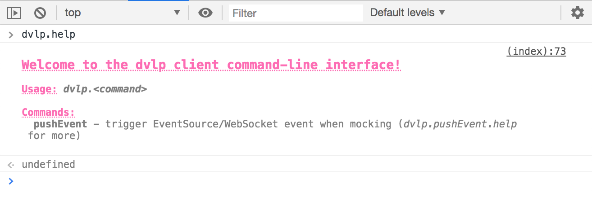
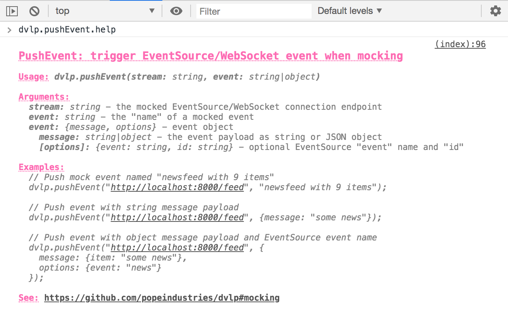

[](https://npmjs.org/package/dvlp)
[](https://github.com/popeindustries/dvlp/actions)

# 💥 dvlp

**dvlp** is a no-configuration, no-conditionals, no-middleware, no-nonsense (no-vowels!) **dev server toolkit** to help you develop quickly and easily for the web. You shouldn't have to jump through hoops to get a development environment up and running, and you definitely shouldn't have to include development-only stuff in your high-quality production code! **dvlp** is full of hacks so your code doesn't have to be!

### Motivation

Back in the _good old days_, our web development workflow went something like this: write HTML/CSS/JS, refresh browser, repeat. Years later, with the help of Node.js and emerging standards, we started pre-processing our CSS and transpiling our JS to take advantage of more expressive, agreeable language features. At the same time, as writing code became easier and more enjoyable, we began bundling and packaging our (growing amount of) code for delivery to the browser. The modern web development workflow soon looked like this: write HTML/JSX/SCSS/LESS/CSS/TS/JS, transpile, compile, bundle, (hot) reload, repeat. For those of us ambitious enough to tackle a full-stack, universal JS application, you would also need to include a well timed server restart (somewhere) in there.

Today, history's pendulum is starting to swing back the other way. Thanks to JS modules and excellent Node.js/browser support for new language features, it's time for a _simpler_, more _comfortable_ workflow. Bundling should be treated as a production optimization (like minification), and our application web servers shouldn't be responsible for building our development assets.

Less setup, less complexity, and less waiting is surely the path to developer happiness and comfort.

### Philosophy

- **No bundling**: write JS modules and load them directly in the browser
- **No middleware**: write application servers without special dev/build/bundle middleware
- **No infrastructure**: mock external JSON/EventSource/WebSocket resources
- **No waiting**: restart application servers in the blink of an eye
- **No refreshing**: automatically reload browsers on file change

### How it works

**dvlp** allows you to easily serve files from one or more project directories (`static` mode), or from your custom application server (`app` mode). In both cases, **dvlp** automatically injects the necessary reload script into HTML responses to enable reloading, watches all files for changes, restarts the `app` server if necessary, and reloads all connected browsers.

In addition, when working with JS modules, **dvlp** will ensure that so-called _bare_ imports (`import "lodash"`), which are not supported by browsers, work by re-writing all import paths to valid urls. Since most `node_modules` packages are still published as CommonJS modules, each bare import is also bundled and converted to an ESM module using [Rollup.js](https://rollupjs.org). These bundles are versioned and cached for efficient reuse in the `.dvlp` directory under your project root.

### Bonus!

**dvlp** also includes a [`testServer`](#testserveroptions-promisetestserver) for handling various network request scenarios (mocking, latency, errors, offline, etc.) during testing.

## Installation

Install globally or locally in your project with npm/yarn:

```bash
$ npm install dvlp
```

## Usage

```text
$ dvlp --help

Usage: dvlp [options] [path...]

  Start a development server, restarting and reloading connected browsers on file changes.
  Serves static files from one or more "path" directories, or a custom application
  server if "path" is a single file.

  Options:

    -p, --port <port>           port number
    -m, --mock <path>           path to mock files (directory, file, glob pattern)
    -t, --transpiler <path>     path to optional transpiler file
    -s, --silent                suppress default logging
    --no-reload                 disable reloading connected browsers on file change
    -v, --version               output the version number
    -h, --help                  output usage information
```

Add a script to your package.json `scripts`:

```json
{
  "scripts": {
    "dev": "dvlp --port 8000 src/app.js"
  }
}
```

...and launch:

```text
$ npm run dev
```

### Transpiling

In some cases, you may want to write CSS/JS in a non-standard, higher-order language like SASS (for CSS), or JSX (for JS). In these cases, you can pass **dvlp** a `transpile` function to convert file contents on the fly when imported by an application server or requested by the browser.

<details>
<summary>Writing a transpiler</summary>

The `transpile` function should accept a `filePath` string and `isServer` boolean, and return a content string (or a string resolving Promise if **not** transpiling a server file) if the file has be transpiled. If nothing is returned, **dvlp** will handle the file normally:

```js
// scripts/transpile.js
const fs = require('fs');
const sass = require('sass');
const sucrase = require('sucrase');

const RE_JS = /\.jsx?$/;
const RE_SASS = /\.s[ac]ss$/;

/**
 * Transpile server and client files
 *
 * @param { string } filePath
 * @param { boolean } isServer
 */
module.exports = function transpile(filePath, isServer) {
  const jsTransforms = isServer ? ['imports', 'jsx'] : ['jsx'];

  if (RE_SASS.test(filePath)) {
    return sass.renderSync({
      file: filePath
    }).css;
  } else if (RE_JS.test(filePath)) {
    return sucrase.transform(fs.readFileSync(filePath, 'utf8'), {
      transforms: jsTransforms
    }).code;
  }
};
```

...reference the original file as you normally would:

```html
<link rel="stylesheet" href="src/index.sass" />
```

...and pass a reference to the `transpile.js` file with the `-t, --transpiler` flag:

```json
{
  "scripts": {
    "dev": "dvlp --transpiler scripts/transpile.js --port 8000 src/app.js"
  }
}
```

</details>

In order to keep things snappy, **dvlp** will cache transpiled content and only re-transpile single files when the original contents have changed.

### Mocking

When developing locally, it's often useful to mock responses for requests made by your server or client application, especially when working with an external API. **dvlp** lets you quickly and easily mock endpoints by intercepting requests that match those registered with the `-m, --mock` flag.

<details>

<summary>Mocking request/response</summary>

Mock a response by creating a `.json` file describing the mocked `request/response`:

```json
{
  "request": {
    "url": "http://www.someapi.com/v1/id/101010",
    "ignoreSearch": true
  },
  "response": {
    "headers": {
      "x-custom": "custom header"
    },
    "body": {
      "user": {
        "name": "Nancy",
        "id": "101010"
      }
    }
  }
}
```

(_Setting `request.ignoreSearch = true` will ignore query parameters when matching an incoming request with the mocked response_)

Bad responses can also be mocked by setting `hang`, `error`, `missing`, or `offline` response properties:

```json
{
  "request": {
    "url": "http://www.someapi.com/v1/id/101010"
  },
  "response": {
    "error": true,
    "body": {}
  }
}
```

Multiple mocked responses may also be included in a single file:

```json
[
  {
    "request": {
      "url": "http://www.someapi.com/v1/id/101010"
    },
    "response": {
      "body": {}
    }
  },
  {
    "request": {
      "url": "http://www.someapi.com/v1/id/202020"
    },
    "response": {
      "body": {}
    }
  }
]
```

Though JSON responses are probably the most common, it's also possible to mock other types of payloads by linking the `response.body` to an external file:

```json
{
  "request": {
    "url": "http://www.someplace.com/images/avatar.jpg"
  },
  "response": {
    "body": "../assets/avatar.jpg"
  }
}
```

(_File paths referenced in `response.body` are relative to the mock file, not the web/project root_)

Register mocked responses with the command-line flag `-m, --mock` and a path to your mock files:

```json
{
  "scripts": {
    "dev": "dvlp --mock path/to/mock/files --port 8000 src/app.js"
  }
}
```

Your `path/to/mock/files` could be one of the following:

- path to directory of files: `path/to/mock/directory`
- path to a single file: `path/to/mock.json`

(_The following require wrapping in `""`_)

- globbed path to multiple files/directories: `"path/to/mock/{api,assets}"`
- multiple files/directories separated by space, `,`, `:`, or `;`: `"path/to/mock1.json, path/to/mock2.json"`

</details>

<details>

<summary>Mocking stream/events</summary>

Mock a `WebSocket` or `EventStream` by creating a `.json` file describing the mocked `stream/events`:

```json
{
  "stream": {
    "url": "ws://www.somesocket.com/stream",
    "ignoreSearch": true,
    "protocol": "socket.io"
  },
  "events": [
    {
      "name": "hello Bob",
      "connect": true,
      "message": {
        "people": ["Bob Builder"]
      },
      "options": {
        "event": "update",
        "namespace": "/people"
      }
    },
    {
      "name": "hello Ernie",
      "message": {
        "people": ["Bob Builder", "Ernie Engineer"]
      },
      "options": {
        "event": "update",
        "namespace": "/people"
      }
    }
  ]
}
```

(_Setting `request.ignoreSearch = true` will ignore query parameters when matching an incoming request with the mocked response_)

(_Specifying a `stream.protocol = "socket.io"` will negotiate WebSocket responses using the Socket.io protocol_)

An event's `name` is a custom, unique string used to identify the event for manual triggering (see below). Adding the property `connect: true` will flag an event to be triggered automatically on initial connection.

A sequence of events may also be described by nesting events under the `sequence` property:

```json
{
  "stream": {
    "url": "http://www.someeventsource.com/stream"
  },
  "events": [
    {
      "name": "a sequence of unfortunate events",
      "sequence": [
        {
          "message": "oh",
          "options": {
            "event": "update"
          }
        },
        {
          "message": "no",
          "options": {
            "event": "update",
            "delay": 100
          }
        },
        {
          "message": "not",
          "options": {
            "event": "update",
            "delay": 50
          }
        },
        {
          "message": "again!",
          "options": {
            "event": "update",
            "delay": 10
          }
        }
      ]
    }
  ]
}
```

Register mocked responses with the command-line flag `-m, --mock` and a path to your mock files:

```json
{
  "scripts": {
    "dev": "dvlp --mock path/to/mock/files --port 8000 src/app.js"
  }
}
```

Your `path/to/mock/files` could be one of the following:

- path to directory of files: `path/to/mock/directory`
- path to a single file: `path/to/mock.json`

(_Note that the following require wrapping in `""`_)

- globbed path to multiple files/directories: `"path/to/mock/{api,assets}"`
- multiple files/directories separated by space, `,`, or `;`: `"path/to/mock1.json, path/to/mock2.json"`

</details>

<details>

<summary>Triggering mocked stream events</summary>

Once registered, mocked stream events may be triggerd from your browser's console:

```js
dvlp.pushEvent('ws://www.somesocket.com/stream', 'hello Ernie');
```

See the full documentation by writing `dvlp.help` and `dvlp.pushEvent.help` in your browser's console:




</details>

### Bundling

As mentioned in [How it works](#how-it-works), **dvlp** will bundle CommonJS packages imported from `node_modules` in order to convert them to es6 modules. [Rollup.js](https://rollupjs.org) is used to create these bundles, and they are then cached on disk inside the `.dvlp` directory under your project root.

<details>

<summary>Overriding default Rollup config</summary>

In the rare case you need to configure Rollup.js to work with the packages you're importing, you can add a custom configuration file to the `.dvlp` directory (`.dvlp/rollup.config.js`).

**dvlp** will override/ignore the `input`, `treeshake`, and `watch` input options, as well as the `file`, `format`, and `sourcemap` output options. Here is the default configuration currently used:

```js
{
  input: 'path/to/temp/file',
  treeshake: false,
  output: {
    file: 'path/to/cache/file',
    format: 'es',
    sourcemap: false
  },
  external: (id) => /^[^./]/.test(id),
  plugins: [
    resolve({
      browser: true
    }),
    json(),
    commonjs({
      sourceMap: false
    })
  ]
}
```

All supported options are listed in the Rollup.js [documentation](https://rollupjs.org/guide/en#big-list-of-options).

</details>

## Debugging

**dvlp** uses the [debug.js](https://github.com/visionmedia/debug) debugging utility internally. Set the following environment variable before running to see detailed debug messages:

```text
$ DEBUG=dvlp* npm run dev
```

## Experimental

- **Bundle modules in multiple, separate processes**: launch with `BUNDLE_WORKERS=n` (where `n` is number of background processes) to run module bundling operations in separate background processes (default is `0`)

## JS API

### `server(filePath: string|[string]|() => void, [options]): Promise<{ destroy: () => void }>`

Serve files at `filePath`, starting static file server if one or more directories, or app server if a single file or function (which starts an application server when imported/called).

`options` include:

- **`mockPath: string|[string]`** the path(s) to load mock files from (default `''`)
- **`port: number`**: port to expose on `localhost`. Will use `process.env.PORT` if not specified here (default `8080`)
- **`reload: boolean`**: enable/disable browser reloading (default `true`)
- **`silent: boolean`**: disable/enable default logging (default `false`)
- **`transpiler: string`**: the path to a custom transpiler script (default `''`)

```js
const { server } = require('dvlp');
const appServer = await server('path/to/app.js', { port: 8080 });
```

### `testServer([options]): Promise<TestServer>`

Create a server for handling network requests during testing.

`options` include:

- **`autorespond: boolean`** enable/disable automatic dummy responses. If unable to resolve a request to a local file or mock, the server will respond with a dummy file of the appropriate type (default `true`)
- **`latency: number`** the amount of artificial latency to introduce (in `ms`) for responses (default `50`)
- **`port: number`** the port to expose on `localhost`. Will use `process.env.PORT` if not specified here (default `8080`)
- **`webroot: String`** the subpath from `process.cwd()` to prepend to relative paths (default `''`)

```js
const { testServer } = require('dvlp');
const server = await testServer({ port: 8080, latency: 20, webroot: 'lib' });
```

Returns a **`TestServer`** instance with the following methods:

- **`loadMockFiles(filePath: string|[string]): void`** load and register mock response files (see [mocking](#mocking))

```json
{
  "request": {
    "url": "http://www.someapi.com/v1/id/101010"
  },
  "response": {
    "body": {
      "user": {
        "name": "Nancy",
        "id": "101010"
      }
    }
  }
}
```

```js
server.loadMockFiles('path/to/mock/101010.json');
const res = await fetch('http://www.someapi.com/v1/id/101010');
console.log(await res.json()); // => { user: { name: "nancy", id: "101010" } }
```

- **`mockResponse(request: string|object, response: object, once: boolean, onMock: () => void): void`** add a mock `response` for `request`, optionally removing it after first use, and/or triggering a callback when successfully mocked (see [mocking](#mocking))

```js
server.mockResponse(
  '/api/user/1234',
  {
    body: {
      id: '1234',
      name: 'bob'
    }
  },
  true
);
const res = await fetch('http://localhost:8080/api/user/1234');
console.log(await res.json()); // => { id: "1234", name: "bob" }
```

- **`mockPushEvents(stream: string|object, events: object|[object]): void`** add one or more mock `events` for a WebSocket/EventSource `stream` (see [mocking](#mocking))

```js
server.mockPushEvents('ws://www.somesocket.com/stream', [
  {
    name: 'hi',
    message: 'hi!'
  },
  {
    name: 'so scary',
    message: 'boo!'
  }
]);
ws = new WebSocket('ws://www.somesocket.com/stream');
ws.addEventListener('message', (event) => {
  console.log(event.data); // => hi!
});
```

-**`pushEvent(stream: string|object, event: string|object’):void`** push data to WebSocket/EventSource clients. A string passed as 'event' will be handled as a named mock push event (see [mocking](#mocking))

```js
server.pushEvent('ws://www.somesocket.com/stream', 'so scary');
```

- **`destroy(): Promise<void>`** stop and clean up running server

In addition, `testServer` supports the following special query parameters:

- **`offline`** simulate an offline state by terminating the request (`fetch('http://localhost:3333/foo.js?offline')`)
- **`error`** return a 500 server error response (`fetch('http://localhost:3333/foo.js?error')`)
- **`missing`** return a 404 not found response (`fetch('http://localhost:3333/foo.js?missing')`)
- **`maxage=value`** configure `Cache-Control: public, max-age={value}` cache header (`fetch('http://localhost:3333/foo.js?maxage=10')`)
- **`hang`** hold connection open without responding (`fetch('http://localhost:3333/foo.js?hang')`)

### `testServer.disableNetwork(rerouteAllRequests: boolean): void`

Disable all network requests with origin that is not `localhost`. Prevents all external network requests for the current Node.js process. If `rerouteAllRequests` is set to `true`, all external requests will be re-routed to the current running server.

```js
testServer.disableNetwork();
await fetch('https://github.com/popeindustries/dvlp');
// => Error "network connections disabled"
```

### `testServer.enableNetwork(): void`

Re-enables all previously disabled external network requests for the current Node.js process.
